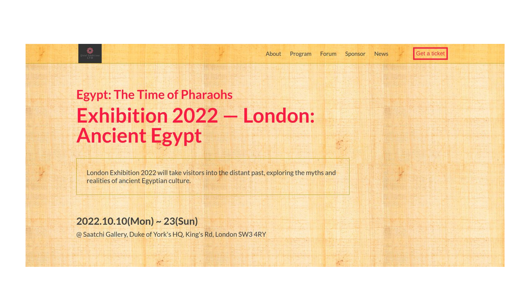

# Microverse: Capstone Project - Exhibition Page

> This project is about an art Exhibition titled "Exhibition 2022 &mdash; London: Ancient Egypt" hold next year in London UK. The work was ordered by Global Exhibitions LTD UK.

The project holds 2 pages: Home page and About page. It is responsive and works well both on mobile and on desktop

## Built With

- Major languages: HTML & CSS along with JavaScript;
- Project hold by GitHub;

## Live Demo

[GitHub Pages live demo link](https://nicupop729.github.io/Exhibition-Page/)
[Netlify live demo link](https://exhibition-page.netlify.app/)

### Deployment

- Deployed by GitHub Pages and Netlify;

## Authors

👤 **Nicolae Pop**

- GitHub: [@nicupop729](https://github.com/nicupop729)
- Twitter: [@nicupop729](https://twitter.com/nicupop729)
- LinkedIn: [LinkedIn](https://www.linkedin.com/in/nicolae-pop/)

## 🤝 Contributing

Contributions, issues, and feature requests are welcome!

## Show your support

Give a ⭐️ if you like this project!

## 📝 License

This project is [MIT](./MIT.md) licensed.
